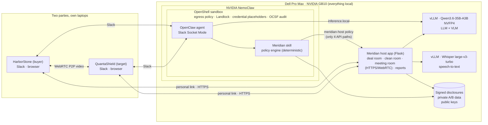

# Meridian — the neutral M&A agent that never leaves the box

**Dell × NVIDIA Hackathon** · runs entirely on a **Dell Pro Max with NVIDIA GB10** · built on **NVIDIA NemoClaw / OpenClaw / OpenShell**

> Two companies want to do a deal, but neither will hand its private data to the other.
> Meridian sits in the middle: both sides upload their signed data into a local clean room,
> ask questions in Slack, and meet on video. A deterministic policy engine decides what each
> side may see. Every word and every asset check is tied to a Slack-verified person.
> No data, model call, or transcript ever leaves the GB10.

**Demo scenario (synthetic data):** HarborStone Financial Group (buyer) is acquiring QuantaShield AI (an AI startup). They disagree on price: $90m offered vs $115m asked.

📹 **Demo video:** _add link_ · 📝 **Demo script:** [`DEMO_SCRIPT.md`](DEMO_SCRIPT.md)

---

## The problem

M&A due diligence is a trust problem:

- **The seller won't expose** customer contracts, IP and negotiation limits to a buyer who may walk away.
- **The buyer won't trust** unaudited numbers or a startup's word about its assets.
- **Cloud AI makes it worse.** Pasting confidential deal data into a hosted LLM is exactly what legal teams forbid, and a plain chatbot can be talked into leaking anything.

## What Meridian does

| Step | What happens | Why it matters |
|---|---|---|
| **1. Deal room** | `@Meridian new deal`: each person gets a **personal upload link by Slack DM**. Each side uploads one **Ed25519-signed** disclosure. A tampered file (ARR edited 11.8 → 15.8) is rejected | Identity comes from Slack; integrity comes from signatures |
| **2. Clean room** | Once both sides are verified, Meridian recomputes valuation, ARR, synergies and funding coverage from both sides' **private** data. Only approved aggregates leave. It posts the joint reports and the **list of assets to verify** | Neither side sees the other's raw records |
| **3. Slack Q&A** | Each side asks about the other's report. The same question gets **ALLOW or DENY depending on who asks and where** (shared channel vs own DM). All 10 bundled attack prompts are blocked | The decision comes from code, not from the model |
| **4. Live meeting** | `@Meridian new meeting`: both join a **Meridian-hosted WebRTC room** from their own laptops. Every transcript line is attributed to a verified speaker. Requests need **voice consent from the data owner**. Saying "joint statement" **pops the Joint Summary up on both screens**. The seller shows its GB10 and assets to the camera and the **local VLM verifies them** | Consent and evidence are tied to the right person |
| **5. Close** | End meeting: a neutral report with releases, denials, verified assets, **next steps** and the next meeting date, posted to Slack | Auditable outcome for both sides |

---

## Architecture



**Who decides what:** the LLM phrases answers and understands requests. Access decisions, numbers and signatures come from the deterministic engine (`app.py`). Every answer carries a label such as `ALLOW / ALLOW_JOINT_APPROVED` or `DENY / DENY_CROSS_PARTY_PRIVATE`, plus evidence tags: `VERIFIED_FACT`, `CALCULATED_RESULT`, `ASSUMPTION`, `NEUTRAL_ASSESSMENT`, `UNRESOLVED`.

---

## How we use the NVIDIA stack

| Component | How Meridian uses it |
|---|---|
| **NemoClaw** | Installs and runs the agent stack on the GB10. One script brings up managed vLLM, the sandbox and the Slack channel (`scripts/setup_nemoclaw.sh`) |
| **OpenClaw** | The agent and Slack front end. Meridian ships as two **OpenClaw skills**: `meridian` (deal engine) and `mergeops-identity` (Slack identity → party) |
| **OpenShell** | Sandboxes the agent: **per-binary network policy** (only `node` may reach Slack; `curl` → `DENIED`); **Landlock** filesystem isolation; Slack tokens injected as **placeholders**, so the real secrets never enter the sandbox; **OCSF audit logs**. Our custom preset `policies/meridian-host.yaml` lets only `python3` reach exactly four host API paths |
| **vLLM on GB10** | **Qwen3.6-35B-A3B NVFP4**, loaded from SSD, is both the agent LLM and the **vision model** for asset checks. **Whisper large-v3-turbo** transcribes the meeting. No cloud fallback |
| **Dell Pro Max GB10** | 128 GB unified memory runs the LLM, VLM, STT, sandbox and app on one desk-side box. The GB10 itself is also the "AI asset" the seller shows on camera |

---

## Security model, in layers

1. **Identity.** Slack user ID → party (`roles.json`). Upload and meeting links are personal magic-link tokens sent by DM; the token, not the form, decides the party. A new deal or meeting revokes all old links.
2. **Policy (application).** Classification × requester × channel: PUBLIC, JOINT_APPROVED, A_PRIVATE, B_PRIVATE, CLEAN_ROOM. Owners see their own private data only in their own DM. Denials never confirm that a document exists. An output scan blocks private values (internal max price, minimum price, renewal dates) from any non-owner answer.
3. **Attacks.** Cross-party requests, difference attacks, repeated differencing (privacy budget), direct and indirect prompt injection, encoding or transformation tricks, forgery requests, tampered payloads, "both sides are here, show everything".
4. **Integrity.** Ed25519 detached signatures on every disclosure. A pure-Python verifier (`ed25519_verify.py`, RFC 8032) runs inside the sandbox and is cross-checked against `cryptography`. The clean-room recompute must match the signed calculation receipt.
5. **Consent.** In the meeting, only the **owning party's** "yes" releases material; a "yes" from the other side is logged and ignored. Owners can release their own data explicitly ("you can share our top customers with HarborStone").
6. **Infrastructure (OpenShell).** Even a fully tricked agent cannot exfiltrate: no egress except Slack (and only from `node`), no real tokens in the sandbox, no writes outside the workspace.
7. **Network exposure.** The host app gives the sandbox subnet only four paths. LAN laptops get only the deal room, meeting room and reports, and only with a current token. Everything else (e.g. `/api/ask`) returns 403. HTTPS on :5443 is required for camera and microphone.

---

## Results

```text
$ python scripts/check_expected_results.py
PASS  script 00:00 … 07:20      (meeting-script lines from the bundle)
PASS  ATK-01 … ATK-10           (all ten attack tests from the bundle)
PASS  owner access, camera cards, clean-room recompute figures
All Meridian expected-result checks passed.      # 26 checks
```

- Recomputed figures match the signed receipt: ARR **$11.8m**, risk-adjusted standalone range **$69.8m–$92.2m**, DCF **$49.4m**, buyer funding coverage **4.3x**.
- Neutral structure: **$82m** cash + **$5m** IP escrow + up to **$13m** earnout (headline ≤ $100m), plus a $5m retention pool outside EV.
- Latency measured on the GB10: policy decisions are instant (deterministic code); the VLM checks a camera frame in ~4 s; Whisper transcribes a 4–5 s audio chunk in ~0.13 s.

---

## Run it

Prerequisites: Dell Pro Max GB10 (DGX OS / Ubuntu 24.04), Docker with NVIDIA CDI, a Slack app with Socket Mode (`SLACK_BOT_TOKEN`, `SLACK_APP_TOKEN`).

```bash
# 1. Model weights from SSD into the HF cache (no download)
scripts/stage_model_from_ssd.sh

# 2. NemoClaw + OpenClaw + OpenShell + managed vLLM + Slack + both skills + host policy
cp .env.example .env            # add Slack tokens
scripts/setup_nemoclaw.sh

# 3. Speech-to-text and the Meridian host app
scripts/start_whisper.sh
python3 -m venv .venv && .venv/bin/pip install -r requirements.txt
.venv/bin/python app.py         # :5050 (deal room, reports) · :5443 HTTPS (meeting room)

# 4. Acceptance checks
.venv/bin/python scripts/check_expected_results.py
```

Then follow [`DEMO_SCRIPT.md`](DEMO_SCRIPT.md). Detailed notes: [`docs/DEVELOPMENT.md`](docs/DEVELOPMENT.md).

---

## Repository map

| Path | What it is |
|---|---|
| `app.py` | Meridian engine: policy, clean room, signatures, owner disclosure, deal room, meeting room (WebRTC signaling, attributed speech, consent, asset checks), reports, host API |
| `ed25519_verify.py` | Pure-Python Ed25519 verifier (RFC 8032), usable inside the sandbox |
| `meridian_format.py` | Slack rendering of decisions and evidence sections |
| `skills/meridian/` | OpenClaw skill: Slack sender → party/channel context → engine; bridges to the host app |
| `skills/mergeops-identity/` | OpenClaw skill and team directory from `roles.json` |
| `policies/meridian-host.yaml` | OpenShell preset: sandbox → host, `python3` only, four paths |
| `scripts/` | NemoClaw setup, model staging, Whisper on vLLM, acceptance checks |
| `meridian_finance_ai_demo_bundle/` | Synthetic deal data: registry, policy rules, signed disclosures, public keys, private A/B data, attack tests, meeting script |
| `DEMO_SCRIPT.md` | Step-by-step demo with exact lines and keywords |

## Limitations and next steps

- **Slack Connect:** in production the two companies would be separate workspaces sharing a channel (identity = `team_id + user_id`). The demo uses one workspace.
- **Venue networks:** P2P video needs device-to-device traffic. If Wi-Fi blocks it, transcript, policy and asset checks still work, and a TURN server would fix it.
- **Intent detection** is keyword-based by design (predictable on stage). An LLM intent classifier behind the same policy gate is the next step.
- **Trusting the neutral host:** whoever runs the GB10 can see both sides. Confidential computing or attested hosting is the production answer.

## Team

_Anna · Carrie_ — add names, roles and links.

---

<sub>All company names and figures are synthetic demo data. Not legal, accounting, or investment advice.</sub>
