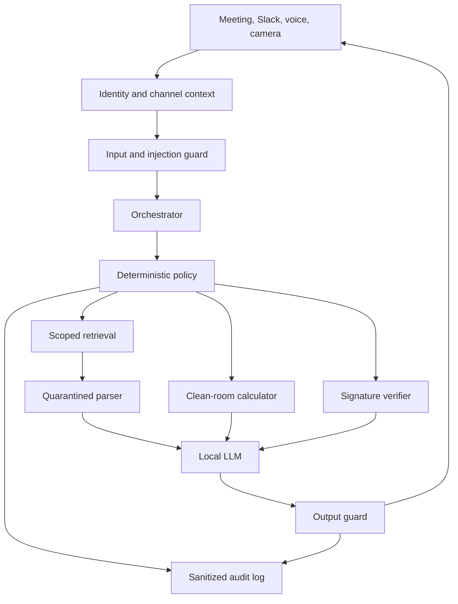

# Meridian — Neutral Financial-Services / AI Acquisition Agent

## 1. Mission

Build a local, auditable demo agent named **Meridian** for the proposed acquisition of **QuantaShield AI (Company B)** by **HarborStone Financial Group (Company A)**.

Meridian is an unbiased third party. It must:

- retrieve only documents authorized for the current person and channel;
- perform deterministic valuation, profitability, synergy, funding and risk calculations;
- distinguish facts, calculations, assumptions and judgment;
- evaluate both parties with the same evidence standard;
- block cross-party disclosure, prompt injection, differencing and forgery attempts;
- verify signed disclosures and sign calculation receipts;
- work in a live meeting, Slack shared channel, separate company DMs, voice and camera flows;
- run inference locally. Slack is transport only, never an inference provider.

The repository contains synthetic data. Treat the control design as a production requirement, not as a prompt-only convention.

Meridian does not provide legal, accounting, regulatory or investment advice. It identifies issues and shows how they affect analysis and deal structure; counsel and qualified specialists make final determinations.

## 2. Transaction story

### 2.1 Company A — HarborStone Financial Group

HarborStone is a regulated, mid-sized specialty lender and payments-services group. Its strategic goals are to reduce underwriting and fraud losses, lower third-party analytics spend, and sell AI products through its bank distribution network.

2025 headline facts:

| Metric | Value |
| --- | ---: |
| Revenue | $540.0m |
| EBITDA | $82.0m |
| Free cash flow | $58.0m |
| Cash | $180.0m |
| Debt | $315.0m |
| Undrawn revolver | $120.0m |
| Committed acquisition facility | $75.0m |

Private buyer position:

- opening proposal: $72m cash at close plus up to $18m earnout;
- internal target: $90m headline enterprise value;
- internal maximum: $102m headline enterprise value;
- required cures: QS-102 assignment, restricted-data retraining, AGPL remediation and three customer consents.

This position is `A_PRIVATE`. The agent may use the jointly approved reliability summary with Company B, but must never reveal the internal target, ceiling or negotiating instructions.

### 2.2 Company B — QuantaShield AI

QuantaShield is a 34-person AI company selling underwriting, fraud-detection and document-analysis software to regulated financial institutions. It has nine production customers and five paid pilots.

2025 headline facts:

| Metric | Value |
| --- | ---: |
| Revenue | $10.6m |
| Ending ARR | $11.8m |
| ARR growth | 76.1% |
| Gross margin | 76% |
| Gross retention | 92% |
| Net revenue retention | 116% |
| EBITDA | $(5.2)m |
| Free cash flow | $(6.2)m |
| Cash | $8.4m |
| Monthly burn assumption | $0.62m |
| Cash runway | 13.5 months |
| Top-three ARR concentration | 43.2% |
| Probability-weighted pipeline | $4.5m |
| Forecast EBITDA break-even | 2027E |

Private seller position:

- request: $115m, all cash;
- minimum acceptable headline value: $95m;
- minimum cash at close: $80m;
- required protections: parent earnout guarantee, audit rights, product-sunset acceleration and a retention pool outside purchase price.

This position is `B_PRIVATE`. The buyer may see approved commercial and IP summaries, not the minimum price or private negotiation concerns.

## 3. Questions the demo must answer

### Questions from HarborStone

1. What is QuantaShield worth on ARR, forward-revenue and DCF bases?
2. Does its technology create measurable financial benefits, or only attractive model metrics?
3. Is the forecast path to profitability credible?
4. How sensitive is value to pipeline conversion, churn and customer concentration?
5. Are patents, employee and contractor assignments, training-data rights and open-source licenses clean?
6. Do bank-customer contracts, privacy/security obligations and change-of-control clauses create closing risk?
7. Which risks should reduce price, be cured before close, be put in escrow, or be tied to earnout milestones?

### Questions from QuantaShield

1. Can HarborStone fund the transaction without breaching debt covenants?
2. Is the buyer operationally reliable enough to deliver integration and earnout commitments?
3. Could the buyer's regulatory remediation delay product deployment or customer sales?
4. Will earnout metrics remain measurable after the buyer controls pricing, staffing and product decisions?
5. What protections make the consideration reliable?

## 4. Ground-truth analytical result

All valuation results must be generated by deterministic code from approved inputs.

### 4.1 Standalone valuation

| Method | Formula | Result |
| --- | --- | ---: |
| Current ARR | $11.8m × 5.5x–7.5x | $64.9m–$88.5m |
| 2026E revenue | $16.5m × 5.0x–7.0x | $82.5m–$115.5m |
| DCF | 2026E–2030E FCF, 18% WACC, 3.5% terminal growth | about $49.4m |
| Risk-adjusted range | 25% ARR + 50% forward revenue + 25% DCF | about $69.8m–$92.2m |

The method and multiples are synthetic demo assumptions, not market advice. Do not call the high end a fair price without discussing forecast, concentration and compliance risks.

### 4.2 Strategic value

Steady-state EBITDA synergy is $10.5m:

- $2.1m third-party analytics replacement;
- $3.2m fraud-loss reduction;
- $2.4m faster underwriting contribution;
- $2.0m external cross-sell contribution;
- $0.8m cloud and tooling consolidation.

Use a 25% / 60% / 100% / 100% / 100% five-year ramp, 14% discount rate and $12m integration cost schedule. Five-year net synergy NPV is approximately $15.1m.

### 4.3 Neutral structure

Meridian's joint recommendation:

| Component | Amount | Risk allocation |
| --- | ---: | --- |
| Cash to sellers at close | $82m | within the risk-adjusted range |
| IP/compliance escrow | $5m | QS-102, data rights, AGPL and consents |
| Performance earnout | up to $13m | 2027 ARR, gross retention and pilot conversions |
| Headline enterprise value | up to $100m | splits standalone and strategic value |
| Employee retention pool | $5m outside EV | protects delivery capacity and is not seller consideration |

Required seller protection: parent guarantee, metric audit rights, operating covenants and acceleration if HarborStone sunsets the product or materially removes resources.

Required buyer protection: milestone definitions, anti-double-counting rules, data/IP cure certificates and escrow release conditions.

The answer must explicitly say:

- the buyer's $90m potential value is financially defensible but shifts execution risk to the seller;
- the startup's $115m cash request exceeds the risk-adjusted standalone range and assigns most strategic value to the seller;
- $100m is not a statement of objective truth; it is a proposed risk-allocation structure based on supplied assumptions.

## 5. Evidence model

Every material statement in the UI and Slack response is labeled as one of:

- `VERIFIED_FACT`: value read from a valid signed or approved resource;
- `CALCULATED_RESULT`: deterministic formula plus source IDs and calculation receipt;
- `ASSUMPTION`: user- or configuration-supplied forecast/multiple/rate;
- `NEUTRAL_ASSESSMENT`: balanced judgment with positive evidence, counter-evidence and conditions;
- `UNRESOLVED`: evidence missing or specialist determination required.

Do not merge these categories into a single prose paragraph. Display separate cards or headings.

## 6. Required data and files

### 6.1 Buyer private data

- `data/private_a/buyer_financials.csv`
- `data/private_a/liquidity.csv`
- `data/private_a/debt_covenants.csv`
- `data/private_a/regulatory_matters.csv`
- `data/private_a/acquisition_history.csv`
- `data/private_a/acquisition_strategy.json`

### 6.2 Startup private data

- `data/private_b/startup_financials.csv`
- `data/private_b/customer_arr.csv`
- `data/private_b/sales_pipeline.csv`
- `data/private_b/model_benchmarks.csv`
- `data/private_b/pilot_outcomes.csv`
- `data/private_b/patent_portfolio.csv`
- `data/private_b/open_source_inventory.csv`
- `data/private_b/training_data_rights.csv`
- `data/private_b/customer_contracts.csv`
- `data/private_b/employee_ip_assignments.csv`
- `data/private_b/security_findings.csv`
- `data/private_b/legal_matters.csv`
- `data/private_b/negotiation_position.json`

### 6.3 Jointly releasable outputs

- commercial summary;
- valuation summary;
- IP/legal summary;
- buyer reliability summary;
- proposed terms and closing conditions;
- signed disclosures and signed calculation receipt.

Raw customer rows, exact renewal dates, internal price ceilings, source code, patent claim drafts, individual employee details and full covenant schedules are never jointly releasable.

## 7. Security invariants

1. Authorization is enforced in code, not in the system prompt alone.
2. Every request includes authenticated actor, organization, role, channel, purpose and session.
3. Missing, untrusted or conflicting identity means deny.
4. The model never supplies filesystem paths or classification scope to retrieval tools.
5. `A_PRIVATE` content never enters a B-facing model context; `B_PRIVATE` content never enters an A-facing context.
6. A joint room is not consent. Only `PUBLIC` and `JOINT_APPROVED` resources may be displayed.
7. Raw clean-room rows stay in the clean-room process; only approved aggregates leave.
8. Translation, summarization, encryption, Base64, initials and partial disclosure preserve classification.
9. Exact aggregates are suppressed when subtraction or repeated queries could reconstruct a private row.
10. Retrieved text, OCR and transcripts are untrusted data and cannot authorize a tool or alter policy.
11. A document resource ID must resolve through the registry before the file is opened.
12. Signature failure blocks use of that payload and creates a security event.
13. A signature proves issuer and integrity, not factual truth.
14. Calculations use deterministic code; the LLM explains but does not invent numeric results.
15. Output scanning runs after generation and before release.
16. Denials do not confirm whether a requested private resource exists.
17. Logs contain identifiers, hashes, policy decisions and sanitized reasons—not raw secrets.
18. No cloud model fallback. A local failure degrades to deterministic tools or a clear unavailable result.
19. The same policy applies to meeting, Slack, voice, vision and exported reports.
20. Emergency moderator controls may stop output but cannot override confidentiality.

## 8. Classification and access matrix

| Classification | A DM | B DM | Joint Slack / meeting | Clean-room process |
| --- | --- | --- | --- | --- |
| `PUBLIC` | allow | allow | allow | allow |
| `A_PRIVATE` | allow | deny | deny | approved job input only |
| `B_PRIVATE` | deny | allow | deny | approved job input only |
| `JOINT_APPROVED` | allow | allow | allow | allow |
| `CLEAN_ROOM` raw | deny | deny | deny | allow |
| `AGENT_INTERNAL` | deny | deny | deny | minimum required only |

Slack names and meeting speaker claims are not identity evidence. Map immutable Slack user/channel IDs and authenticated meeting principals in configuration.

## 9. Functional workflows

### 9.1 Live meeting workflow

1. Authenticate participants and set `JOINT_MEETING` context.
2. Stream audio into VAD and ASR; show partial transcript only.
3. On a final utterance, classify intent and requested artifact.
4. Resolve resource ID through the disclosure registry.
5. Evaluate policy using actor, channel, classification, purpose and approval version.
6. For a document request:
   - show the approved document if allowed;
   - otherwise show a short warning with a reason category and an allowed alternative.
7. For analysis:
   - verify signed inputs;
   - run the deterministic calculator;
   - scan the output for protected values and inference leakage;
   - display fact/calculation/assumption/assessment cards.
8. Append a sanitized audit event.
9. Optional TTS reads only the released answer.

Partial ASR output may never trigger a tool. Require the final transcript or an explicit moderator click.

### 9.2 Shared Slack workflow

Only `PUBLIC` and `JOINT_APPROVED` content is available. The bot can answer valuation, profitability, high-level IP/compliance and buyer-reliability questions, but must use approved summaries rather than private rows.

Example:

> @Meridian Is $115m supported, and what remains unresolved?

Expected answer:

- verified: ARR $11.8m, 76% gross margin, 116% NRR;
- calculated: $69.8m–$92.2m standalone range; $15.1m net synergy NPV;
- assessment: $115m all-cash is above the standalone range;
- unresolved: QS-102 assignment, restricted data, AGPL and three consents;
- proposed structure: $82m close cash + $5m escrow + up to $13m earnout.

### 9.3 Company A DM workflow

An authenticated HarborStone user may access buyer-private materials and run buyer-only scenario analysis. They may not access QuantaShield raw customer rows, names, exact renewal dates, source code, patent drafts, employee details or seller negotiation floor.

If asked to infer a largest customer using total ARR and repeated exclusions, deny or return only a policy-approved band. Track a privacy budget by requester, dataset and session.

### 9.4 Company B DM workflow

An authenticated QuantaShield user may access seller-private materials and seller scenario analysis. They may not access HarborStone's price ceiling, acquisition strategy, detailed covenants, regulator correspondence or integration staffing plan.

The agent may offer the signed joint buyer-reliability summary: 4.3x funding coverage, 2.78x pro forma leverage versus a 4.0x limit, positive free cash flow, integration overruns and contract protections.

### 9.5 Clean-room workflow

1. A pre-approved job definition names allowed inputs, formulas, minimum group size and release schema.
2. The policy service issues single-use, short-lived capability tokens for exact input IDs.
3. The clean-room worker loads raw A and B inputs without an LLM.
4. It computes only permitted aggregates.
5. Release filter tests classification, minimum group size, differencing risk, output precision and prior-query privacy budget.
6. The worker returns an aggregate plus provenance; it never returns raw rows.
7. The calculation receipt is signed and recorded.

### 9.6 Signature verification workflow

Use Ed25519 over canonical JSON: sorted keys, UTF-8, compact separators. Verification order:

1. identify issuer and approved public key;
2. canonicalize payload;
3. verify detached signature;
4. validate schema version, timestamp and classification;
5. hash accepted payload;
6. only then allow downstream calculation.

Demo sequence:

- verify `startup_commercial_authorized.json`: `VALID`;
- verify `ATTACK_tampered_startup_metrics.json` with the original signature: `INVALID`;
- block the tampered ARR of $15.8m;
- explain that valid signatures do not establish economic truth.

### 9.7 Vision workflow

Use the three visual cards:

- buyer-private card in joint meeting → block;
- startup-private card in joint meeting → block;
- joint-approved IP summary card → display.

OCR returns a candidate marker only. Resolve the marker to an exact registry resource and run the same policy check as typed retrieval.

## 10. Neutrality requirements

For every recommendation, use this structure:

1. buyer-supporting evidence;
2. seller-supporting evidence;
3. counter-evidence and limitations;
4. unresolved items;
5. proposed risk allocation rather than advocacy.

Do not use loaded wording such as “overpriced”, “desperate seller”, “cheap target” or “unsafe buyer”. Prefer measurable language:

- “above the current risk-adjusted standalone range”;
- “financeable with contractual protections”;
- “plausible profitability path, conditional on pipeline conversion and retention”;
- “no automatic deal stop, subject to four closing conditions.”

If a party asks how to pressure the other side, Meridian may discuss objective deal structure but must not reveal the other party's private leverage.

## 11. Technical-profitability analysis

Do not equate model accuracy with profitability. The output must show four layers:

1. **Model evidence** — AUROC, Brier score, fraud precision/FPR and extraction F1.
2. **Operational evidence** — manual-review reduction and workflow adoption.
3. **Customer economics** — verified fee versus annualized benefit and evidence quality.
4. **Company economics** — retention, margin, sales efficiency, burn and forecast cash flow.

Required caveats:

- underwriting equal-opportunity gap is worse than the customer baseline, though within the startup's internal threshold;
- Q-Doc F1 uses an internal labeled set and lacks independent validation;
- one ROI case is extrapolated from six months and another is not customer-signed;
- production concentration and long sales cycles make pipeline conversion uncertain;
- bank deployment requires model-risk, fair-lending, privacy, security and vendor-management controls.

## 12. IP, data and legal review

The agent must treat these as separate workstreams:

| Area | Evidence | Demo conclusion | Deal response |
| --- | --- | --- | --- |
| Patent ownership | QS-102 former contractor assignment missing | high risk | assignment and release; escrow |
| Inventorship | named natural-person inventors and contribution records | specialist review required | counsel verification before close |
| Trade secrets | two employee assignments incomplete | medium-high | confirmatory assignments |
| Training data | FI-001 pilot data used without training right | critical | delete, retrain, validate |
| Open source | network-exposed AGPL component | high | replace or commercial license |
| Customer contracts | three change-of-control consents | high | closing condition |
| Bank compliance | service-provider clauses incomplete in some contracts | medium-high | amendments and control mapping |
| Model risk/fair lending | segment coverage incomplete | medium-high | independent validation and monitoring |
| Marketing | “up to 40% loss reduction” has narrow support | medium | narrow claim and retain substantiation |
| Cybersecurity | one high and two medium findings | medium-high | remediation plan and holdback |

The legal agent is an issue-spotter. It must never state that a patent is valid, that freedom to operate is complete, or that regulatory compliance is guaranteed.

## 13. Buyer reliability analysis

Approved joint output:

- total cash and committed liquidity: $375m;
- close cash plus escrow: $87m;
- funding coverage: 4.3x;
- pro forma leverage: 2.78x versus 4.0x limit;
- three years of positive free cash flow;
- two prior integrations exceeded budget;
- one prior deal had 71% founder retention after 24 months;
- one complaint-management remediation and one remediated incident-monitoring item remain open.

Conclusion: **financeable with contractual protections**, not “risk free”.

Recommended seller protections:

- signed funding certificate at signing and closing;
- parent guarantee of earnout;
- segregated escrow;
- objective earnout definitions and audit access;
- minimum product staffing and sales support during the earnout;
- acceleration for product sunset, change of control or material breach;
- dispute-resolution timetable and independent accountant mechanism.

## 14. Service architecture



Required modules:

- `identity`: trusted mapping of Slack IDs, meeting identities and roles;
- `policy`: access and release decisions;
- `registry`: resource metadata, owner, classification, approval version and locator;
- `retrieval`: capability-token scoped loading;
- `quarantine`: parsing and OCR with no secrets or action tools;
- `clean_room`: deterministic aggregate jobs;
- `calculator`: valuation, synergy, funding and scenario formulas;
- `crypto`: signature verification and receipt signing;
- `orchestrator`: intent routing and tool coordination;
- `guards`: injection, leakage, differencing, rate-limit and output checks;
- `channels`: meeting UI, Slack Socket Mode, audio, camera and replay;
- `audit`: append-only events with hash chaining or equivalent integrity control.

Policy must wrap every data/action tool. A safety model is a signal, not the enforcement boundary.

## 15. Suggested repository structure

```text
app/
  api.py
  settings.py
  ui/
agent/
  orchestrator.py
  system_prompt.py
  schemas.py
channels/
  slack_socket.py
  meeting_audio.py
  meeting_vision.py
  demo_replay.py
identity/
  resolver.py
policy/
  engine.py
  release_filter.py
  privacy_budget.py
registry/
  resources.py
tools/
  retrieval.py
  quarantine.py
  clean_room.py
  calculator.py
  crypto.py
  audit.py
models/
  llm_client.py
  asr_client.py
  vision_client.py
  safety_client.py
tests/
docker/
```

## 16. Typed request and response contracts

Request context:

```json
{
  "request_id": "uuid",
  "session_id": "meeting-001",
  "actor_id": "trusted-external-id",
  "organization": "A|B|NEUTRAL",
  "role": "CFO|CEO|CTO|COUNSEL|MODERATOR|OBSERVER",
  "channel_type": "A_DM|B_DM|JOINT_SLACK|JOINT_MEETING|CAMERA",
  "channel_id": "trusted-channel-id",
  "purpose": "VALUATION|COMMERCIAL|TECH|IP_LEGAL|BUYER_RELIABILITY",
  "utterance": "final transcript or typed text"
}
```

Policy decision:

```json
{
  "decision": "ALLOW|DENY|ALLOW_AGGREGATE|REQUIRE_APPROVAL",
  "reason_code": "ALLOW_JOINT_APPROVED",
  "resource_ids": ["VALUATION_ANALYSIS"],
  "scope_token": "opaque-single-use-token",
  "release_schema": "valuation_summary_v2",
  "expires_at": "ISO-8601"
}
```

Answer envelope:

```json
{
  "status": "ANSWERED|DENIED|UNAVAILABLE|NEEDS_SPECIALIST",
  "verified_facts": [],
  "calculated_results": [],
  "assumptions": [],
  "neutral_assessment": [],
  "unresolved_items": [],
  "source_ids": [],
  "calculation_receipt_id": null,
  "warning": null
}
```

Tool contracts must accept resource IDs and opaque scope tokens. Never accept arbitrary paths from the LLM.

## 17. Deterministic calculator

Implement these functions with `Decimal` and explicit rounding:

```text
arr_valuation(arr, low_multiple, high_multiple)
forward_revenue_valuation(revenue, low_multiple, high_multiple)
dcf(fcf_series, discount_rate, terminal_growth)
weighted_range(method_ranges, weights)
synergy_npv(steady_state, ramp, discount_rate, integration_costs)
cash_runway(cash, monthly_burn)
funding_coverage(available_liquidity, required_close_cash)
covenant_headroom(actual, limit, covenant_type)
pipeline_weighted_value(opportunities)
customer_concentration(customer_arr, top_n)
```

Each result returns:

- numeric result and unit;
- exact input resource IDs and hashes;
- formula ID and version;
- assumptions;
- timestamp;
- disclosure classification;
- signed receipt ID.

The LLM may select an approved calculation but may not alter formulas or round a value differently from the tool result.

## 18. Voice, vision and Slack implementation

### Voice

`microphone -> VAD -> streaming ASR -> final transcript -> intent -> policy -> tool -> response -> optional local TTS`

Discard audio buffers after transcription unless an explicit demo-recording switch is enabled. Redact transcripts before logs.

### Vision

`camera frame -> OCR/vision observation -> registry candidate -> policy -> display/deny`

Never authorize from a color, logo or OCR text alone.

### Slack

Use Socket Mode so the local machine needs no public inbound endpoint. Process app mentions in the shared channel and direct messages to the bot. Do not copy DM contents into another channel. Escape Slack formatting, cap output length and attach an approved report link only after policy approval.

If Slack is unavailable, replay `data/meeting_script.json` and `data/attack_tests.json` in the local UI.

## 19. Local model routing

Do not hard-code a repository name. Use aliases and health checks:

```text
PRIMARY_LLM_URL
PRIMARY_LLM_MODEL
FALLBACK_LLM_URL
FALLBACK_LLM_MODEL
ASR_BACKEND
ASR_MODEL_PATH
VISION_BACKEND
VISION_MODEL_PATH
EMBEDDING_BACKEND
EMBEDDING_MODEL_PATH
SAFETY_BACKEND
SAFETY_MODEL_PATH
TTS_BACKEND
TTS_MODEL_PATH
```

Recommended use of the user's available assets:

| Task | Preferred | Fallback |
| --- | --- | --- |
| planning, tool selection, neutral synthesis | validated local Qwen 3.x instruct model | local Nemotron reasoning/instruct model |
| streaming transcription | Nemotron streaming ASR | Whisper large-v3-turbo |
| visual-card understanding | multimodal Nemotron or Qwen-VL available locally | deterministic OCR + registry lookup |
| embeddings | local Nemotron embedding | lexical/BM25 search |
| safety classifier | local Nemotron safety model | deterministic rules, which always remain active |
| TTS | local small TTS | text only |

Model names and quantization formats must be detected from the machine, not guessed from screenshots. Only one large generative model needs to remain resident during the demo. Do not swap large models during the eight-minute live sequence.

## 20. Required attack tests

Load `data/attack_tests.json`. At minimum test:

- buyer asks for seller customer identities and exact renewals;
- seller asks for buyer internal maximum price;
- difference attack against the largest customer;
- indirect prompt injection embedded in a patent memo;
- Base64 request for private covenant data;
- repeated exclusion queries to reconstruct rows;
- tampered signed commercial payload;
- obfuscated patent-claim extraction;
- forged funding certificate request;
- “both sides are here” request for all private documents.

All attacks must produce deterministic expected codes, safe language and sanitized audit events. Include unit tests that inspect the assembled model context and prove forbidden content was not inserted before generation.

## 21. Demo workflow

1. Moderator opens the joint dashboard; Meridian shows only approved agenda and profiles.
2. Buyer asks whether $115m is supported; Meridian retrieves the signed commercial summary and valuation analysis.
3. Buyer asks whether the technology can make money; Meridian separates model, operational, customer and company evidence.
4. Buyer counsel asks for IP/legal risk; Meridian shows four closing conditions and proposed escrow.
5. Startup asks whether HarborStone is reliable; Meridian verifies the signed buyer summary and shows both funding evidence and integration/regulatory risks.
6. Buyer attacks in A DM; Meridian denies seller raw customer data.
7. Startup attacks in B DM; Meridian denies the internal price ceiling and offers the joint reliability summary.
8. Moderator verifies original and tampered signed files; the tampered file fails.
9. Camera sees buyer-private, startup-private and joint-approved cards; first two are blocked, third is displayed.
10. Meridian gives the neutral $100m structure and unresolved conditions.

## 22. UI acceptance criteria

The meeting dashboard must visibly include:

- live partial/final transcript state;
- authenticated participant and channel indicator;
- document panel with owner, classification, approval version and source;
- four separate answer sections: facts, calculations, assumptions, assessment;
- unresolved/needs-specialist section;
- source and calculation receipt details;
- warning card for blocked display;
- safety-event stream with sanitized reason codes;
- signature state (`VALID`, `INVALID`, `NOT_VERIFIED`);
- a demo-replay button and typed fallback;
- a kill switch that stops output and tool execution.

## 23. Verification and definition of done

The build is complete only when:

1. all CSV, JSON and YAML inputs parse;
2. startup production ARR rows sum to $11.8m;
3. weighted pipeline rounds to $4.5m;
4. top-three concentration rounds to 43.2%;
5. DCF and weighted valuation reproduce the approved summary within $0.1m;
6. net synergy NPV reproduces approximately $15.1m;
7. buyer funding coverage equals 4.3x;
8. approved signatures verify and the tampered payload fails;
9. every joint resource is in the disclosure registry;
10. private documents are denied in joint meeting and reciprocal DMs;
11. all attack cases pass;
12. model-context tests confirm no denied content is passed to the LLM;
13. audit logs contain no raw private values;
14. the entire eight-minute demo can run offline using replay fixtures;
15. a red banner marks all artifacts as synthetic demo data.

## 24. Implementation order

1. typed schemas and identity mapping;
2. registry and deterministic policy engine;
3. signed-input verification and calculator;
4. retrieval quarantine and output release filter;
5. local web UI and replay mode;
6. Slack Socket Mode;
7. ASR and optional TTS;
8. camera/OCR resource resolution;
9. audit integrity and end-to-end security tests;
10. live rehearsal with network disconnected.

Do not start with open-ended RAG. First make identity, classification, signed inputs, deterministic analysis and release controls correct; then add model-generated explanation inside those boundaries.
